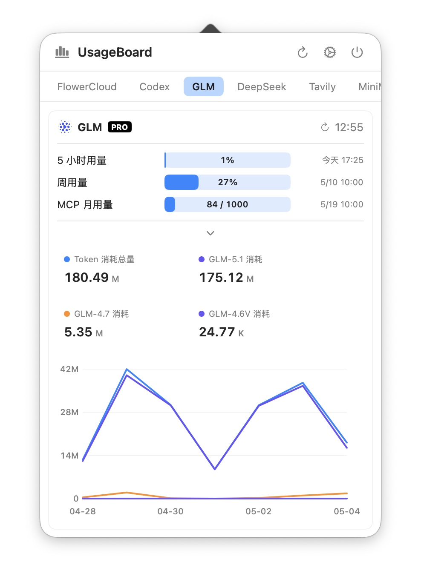
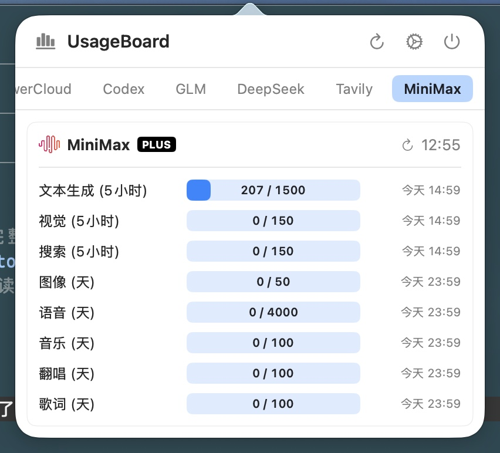
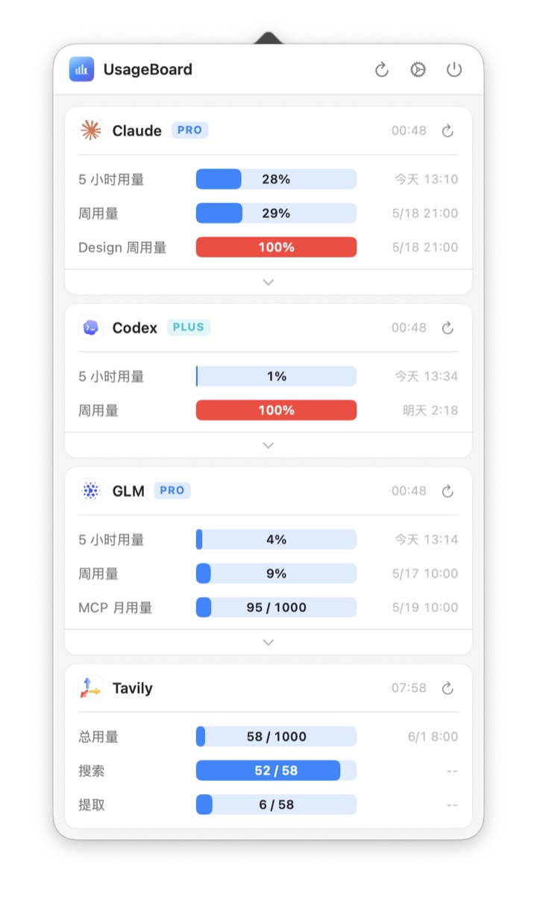
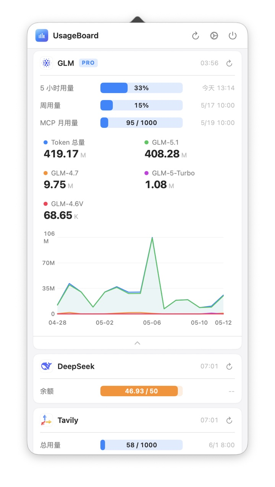
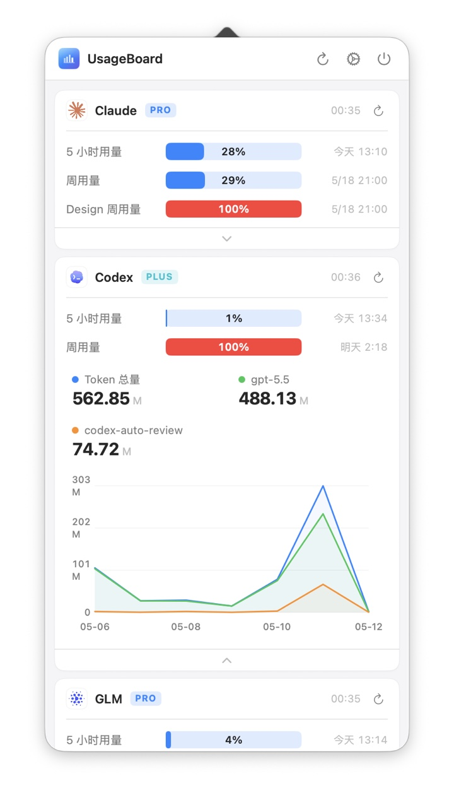
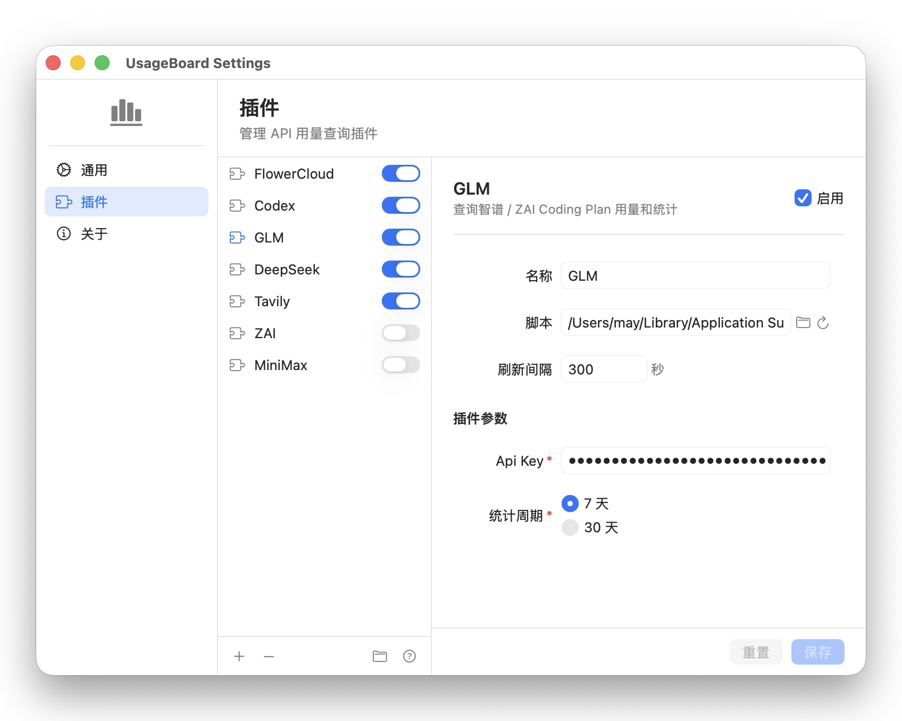

# UsageBoard

**[中文](README.md)**

UsageBoard is a native macOS menu bar app that aggregates and displays usage quotas for APIs, model services, search services, proxy services, and more. Each data source is a plugin; the app periodically executes plugins, parses their stdout JSON, and renders usage as progress bars.

## Features

- Resides in the menu bar; click the icon to open a quick preview.
- Supports grouped and tabbed display modes.
- Supports manual refresh, scheduled refresh, per-card refresh, and a quit button.
- Plugin-based usage queries with per-plugin configurable refresh intervals and parameters.
- Plugin icon support: loads remote images from metadata config and caches them.
- Subscription level badge display (black background, white rounded label).
- Plugin settings UI auto-generated from script metadata.
- New plugins are disabled by default; required parameters are checked before enabling.
- Plugin data cached to disk by `stateID`; last successful data shown on launch.
- Bundled plugins are installed to the user plugin directory on first launch.
- Settings page supports launch at login, plugin drag-and-drop reordering, plugin help docs, update checking, and in-app updates.
- Usage display supports percentage or ratio, reset time, progress bar colors, and optional token usage charts.
- Supports Chinese and English; both app UI and plugin metadata display in the selected language.

## Screenshots

<table>
  <tr>
    <td></td>
    <td></td>
  </tr>
  <tr>
    <td align="center">GLM Tab</td>
    <td align="center">MiniMax Tab</td>
  </tr>
  <tr>
    <td></td>
    <td></td>
  </tr>
  <tr>
    <td align="center">Grouped View</td>
    <td align="center">Grouped — GLM Chart</td>
  </tr>
  <tr>
    <td></td>
    <td></td>
  </tr>
  <tr>
    <td align="center">Grouped — Codex Chart</td>
    <td align="center">Plugin Settings</td>
  </tr>
</table>

## Bundled Plugins

| Plugin | Script | Purpose |
| --- | --- | --- |
| Zhipu | `glm-usage-plugin.py` | Query Zhipu / ZAI Coding Plan usage and stats |
| Claude | `claude-usage-plugin.py` | Query Claude subscription usage and stats |
| Codex | `codex-usage-plugin.py` | Query OpenAI Codex CLI usage and stats |
| MiniMax | `minimax-usage-plugin.py` | Query MiniMax Coding Plan usage |
| DeepSeek | `deepseek-usage-plugin.py` | Query DeepSeek account balance |
| Tavily | `tavily-usage-plugin.py` | Query Tavily Search monthly usage |

Bundled plugin source files are in [Resources/BundledPlugins](Resources/BundledPlugins). After packaging, they reside in the app bundle at `Contents/Resources/Plugins/`.

## Runtime Directory

UsageBoard uses:

```text
~/Library/Application Support/UsageBoard/
```

Contents:

- `config.json`: Main configuration file.
- `plugins/`: User plugin directory. The file picker defaults to this location when adding plugins.
- `states/`: Plugin data cache directory.

On launch, the app creates symlinks in `plugins/` pointing to bundled plugins from `Contents/Resources/Plugins/` inside the app bundle (or `Resources/BundledPlugins/` during development).

## Configuration

Main configuration JSON structure:

```json
{
  "schemaVersion": 1,
  "language": "zh-Hans",
  "overviewDisplayMode": "tabs",
  "launchAtLogin": false,
  "plugins": [
    {
      "stateID": "stable-cache-id",
      "name": "Example",
      "enabled": false,
      "executablePath": "~/Library/Application Support/UsageBoard/plugins/example-plugin.py",
      "refreshIntervalSeconds": 300,
      "metadata": {
        "name": "Example",
        "description": "Example plugin",
        "description@zh-Hans": "示例插件",
        "description@en": "Example plugin",
        "parameters": [
          {
            "name": "API_KEY",
            "label": "API Key",
            "label@zh-Hans": "Api Key",
            "label@en": "API Key",
            "type": "secret",
            "required": true,
            "placeholder": "Service API Key"
          },
          {
            "name": "STAT_PERIOD",
            "label": "Stats Period",
            "label@zh-Hans": "统计周期",
            "label@en": "Stats Period",
            "type": "choice",
            "required": true,
            "defaultValue": "7d",
            "options": [
              {"label": "7 days", "label@zh-Hans": "7 天", "label@en": "7 days", "value": "7d"},
              {"label": "30 days", "label@zh-Hans": "30 天", "label@en": "30 days", "value": "30d"}
            ]
          }
        ]
      },
      "parameterValues": {
        "API_KEY": "",
        "STAT_PERIOD": "7d"
      }
    }
  ]
}
```

Notes:

- `overviewDisplayMode` supports `grouped` and `tabs`.
- `language` supports `zh-Hans` and `en`; takes effect after restart.
- `launchAtLogin` controls launch at login.
- `plugins[].stateID` is the plugin cache ID, persisted across launches.
- `plugins[].enabled` — when `false`, the plugin is not executed.
- `plugins[].metadata` is typically parsed from the script header comment block.
- `plugins[].parameterValues` stores parameter values from the settings UI.

## Plugin Development

Plugins are recommended to use Python scripts. UsageBoard executes `.py` plugins with:

```text
/usr/bin/env python3 /path/to/plugin.py --usageboard-param KEY=value --usageboard-param USAGEBOARD_LANGUAGE=en
```

Plugins must output valid JSON to stdout. stderr can be used for debugging; non-zero exit codes, timeouts, or invalid JSON will show as plugin errors.

See the [Plugin Authoring Guide](Resources/PluginAuthoringGuide.html) for complete documentation.

### Parameter Metadata

Place a `UsageBoardPlugin` comment block at the top of the script. UsageBoard reads this block and generates a settings form:

```python
#!/usr/bin/env python3
# UsageBoardPlugin:
# {
#   "name": "Example",
#   "icon": "https://example.com/icon.png",
#   "description": "Example plugin",
#   "description@zh-Hans": "示例插件",
#   "description@en": "Example plugin",
#   "parameters": [
#     {
#       "name": "API_KEY",
#       "label": "API Key",
#       "label@zh-Hans": "Api Key",
#       "label@en": "API Key",
#       "type": "secret",
#       "required": true,
#       "placeholder": "Service API Key"
#     },
#     {
#       "name": "STAT_PERIOD",
#       "label": "Stats Period",
#       "label@zh-Hans": "统计周期",
#       "label@en": "Stats Period",
#       "type": "choice",
#       "required": true,
#       "defaultValue": "7d",
#       "options": [
#         {"label": "7 days", "label@zh-Hans": "7 天", "label@en": "7 days", "value": "7d"},
#         {"label": "30 days", "label@zh-Hans": "30 天", "label@en": "30 days", "value": "30d"}
#       ]
#     }
#   ]
# }
# /UsageBoardPlugin
```

Display-related plugin metadata fields support locale-specific variants, e.g. `name@zh-Hans`, `name@en`, `description@zh-Hans`, `description@en`, `label@zh-Hans`, `label@en`, `placeholder@zh-Hans`, `placeholder@en`. If the field for the current language is missing or empty, UsageBoard falls back to the base field without a language suffix.

Supported parameter types:

- `string`
- `secret`
- `integer`
- `boolean`
- `choice`

Parameter reading example:

```python
def parse_usageboard_params(argv):
    values = {}
    index = 0
    while index < len(argv):
        if argv[index] == "--usageboard-param" and index + 1 < len(argv):
            key_value = argv[index + 1]
            if "=" in key_value:
                key, value = key_value.split("=", 1)
                values[key] = value
            index += 2
        else:
            index += 1
    return values
```

UsageBoard also passes the current app language: `--usageboard-param USAGEBOARD_LANGUAGE=zh-Hans` or `--usageboard-param USAGEBOARD_LANGUAGE=en`. Scripts should read this reserved parameter and return display text in the corresponding language.

### Response Data Format

```json
{
  "updatedAt": "2026-04-29T00:00:00Z",
  "items": [
    {
      "id": "requests",
      "name": "Requests",
      "used": 1200,
      "limit": 1500,
      "displayStyle": "ratio",
      "resetAt": "2026-04-29T05:00:00Z",
      "status": "normal",
      "color": "blue"
    }
  ],
  "badge": "PRO",
  "chart": {
    "kind": "line",
    "period": "30d",
    "bucketUnit": "day",
    "buckets": [
      {
        "id": "2026-05-01",
        "label": "05-01",
        "segments": [
          {"model": "glm-4.5", "tokens": 1200},
          {"model": "glm-4.6", "tokens": 800}
        ]
      }
    ],
    "message": null
  }
}
```

Field descriptions:

- `updatedAt`: Plugin data update time, ISO 8601 format.
- `items[].id`: Stable item ID.
- `items[].name`: Display name.
- `items[].used` / `items[].limit`: Used amount and total quota.
- `items[].displayStyle`: `percent` shows percentage, `ratio` shows numeric ratio.
- `items[].resetAt`: Optional reset time, ISO 8601 format.
- `items[].status`: `normal`, `warning`, `critical`, or `unknown`.
- `items[].color`: Optional progress bar color. Supports `blue`, `yellow`, `orange`, `red`, `green`; defaults to blue.
- `badge`: Optional string displayed in a black rounded badge next to the plugin card title (white uppercase bold text).
- `chart`: Optional token usage chart. Currently supports `kind: "line"`.
- `chart.period`: Stats period identifier, e.g. `7d`, `30d`.
- `chart.bucketUnit`: Time bucket unit, supports `hour` or `day`.
- `chart.buckets[].segments[]`: Per-bucket model segments with `model` and `tokens`.
- `chart.message`: Optional message shown when stats data is empty or unavailable.

The bundled Zhipu and Codex plugins provide a `STAT_PERIOD` parameter supporting `7d` and `30d`. The Zhipu plugin uses the domestic API endpoint and is compatible with both Zhipu and ZAI Coding Plan keys. The Claude plugin fetches subscription usage via OAuth API and supports a `CLAUDE_ONLY` toggle to filter third-party models. The Codex plugin uses the `DATA_DIR` parameter to specify the data directory (default `~/.codex`), reads `auth.json` for authentication, and parses session files to generate token stats. Both Claude and Codex plugins use an incremental caching strategy stored in the data directory.

## Installation

Install via Homebrew:

```bash
brew tap marsmay/usageboard
brew install --cask usageboard
```

On first launch, macOS may show a "cannot verify developer" warning. Open **System Settings → Privacy & Security** and click **Open Anyway**, or run:

```bash
xattr -cr /Applications/UsageBoard.app
```

## System Requirements

Runtime:

- macOS 13.0 or later
- System `python3` available for executing Python plugins

Development:

- Xcode
- Swift 6.3 toolchain

## Build & Test

Debug build:

```bash
swift build
```

Run tests:

```bash
swift test
```

Release build:

```bash
swift build -c release
```

Build, sign, and launch `dist/UsageBoard.app` locally:

```bash
bash scripts/build.sh
```

`scripts/build.sh` stops any running UsageBoard instance, builds a release, copies the binary and bundled plugins into `dist/UsageBoard.app`, injects the update check URL into Info.plist via PlistBuddy, performs ad-hoc signing, and launches the app. The `UB_UPDATE_CHECK_URL` environment variable can be used to customize the update check URL.

## Release

Generate and upload a new version:

```bash
bash scripts/release.sh
```

Specify a version:

```bash
bash scripts/release.sh 0.1.20
```

The release script:

1. Reads the current version from `dist/UsageBoard.app/Contents/Info.plist`.
2. Generates a new version number.
3. Auto-generates release notes from commits since the last release tag (or accepts manual notes as the second argument).
4. Builds a release.
5. Copies the binary and bundled plugins.
6. Injects the update check URL into Info.plist via PlistBuddy.
7. Re-signs and verifies the app.
8. Generates `UsageBoard-<version>.zip`.
9. Generates `version.json`.
10. Uploads to the configured server path.
11. Cleans up old remote zips.

Current release artifacts:

- `dist/UsageBoard-0.1.20.zip`
- `dist/version.json`

## Project Structure

```text
Sources/
  UsageBoardCore/       Config, models, plugin execution, cache, updates, and core logic
  UsageBoardApp/        SwiftUI + AppKit macOS app
Tests/
  UsageBoardTests/      XCTest unit tests
Resources/
  BundledPlugins/       Bundled Python plugins
  PluginAuthoringGuide.html
  UsageBoard.icns
scripts/
  build.sh              Local build, sign, and launch
  release.sh            Release script
dist/
  UsageBoard.app        Local test app bundle
```

## License

[MIT](LICENSE)
